# Manual de instruções - Sistema Operacional CENTOS 
#### Este manual, tem como finalidade de explicar o passo-a-passo do sistema operacional Centos.

 ### 1º Passo 
 #### Inicialmente, logo após de ter instalado o centOS vai exibir essa tela, onde o usuário colocara o seu idioma de preferência, quando escolher basta aperta em continuar. 
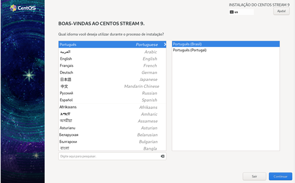

 ### 2º Passo
 #### Em seguida emitirá na tela a parte de configuração, onde deve apertar em "Criação de usuário” 
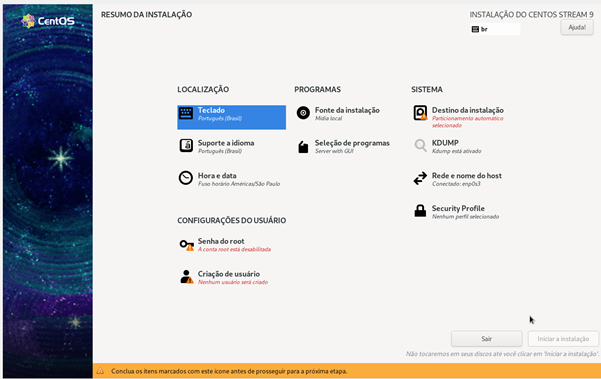

### 3º Passo
#### Ao prosseguir, o usuário colocara seus dados particular e ativara o botão "Tornar esse usuário administrador”, feito isso clique em "pronto”.
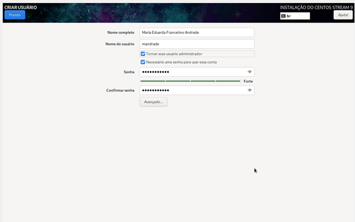

### 4º Passo
#### Voltando nessa parte, basta clicar em "Destino da instalação".
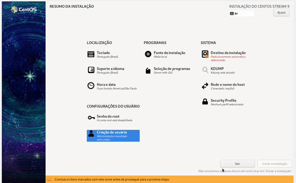

### 5º Passo
#### Logo irá aparecer essa tela onde o usuário só precisa clicar no botão "Pronto”.
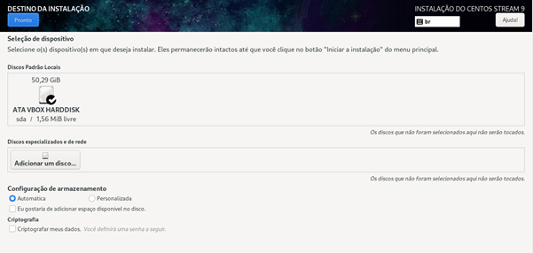

### 6º Passo 
#### Feito isso aperte em ”Iniciar instalação”.
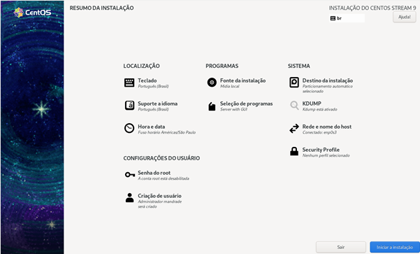

### 7º Passo
#### Nessa etapa basta aguardar o carregamento do sistema operacional.
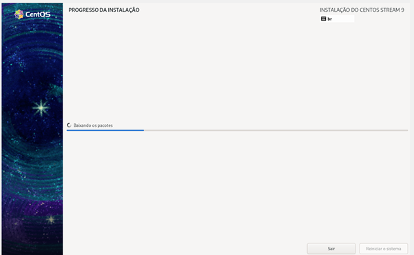

### 8º Passo
#### Quando acabar de carregar clique em “Reiniciar o sistema” 
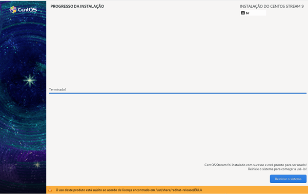

### 9 º Passo
#### Aperte no seu usuário
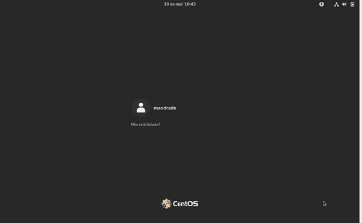 

### 10º Passo
#### Insira a senha criada no começo das configurações feita inicialmente.
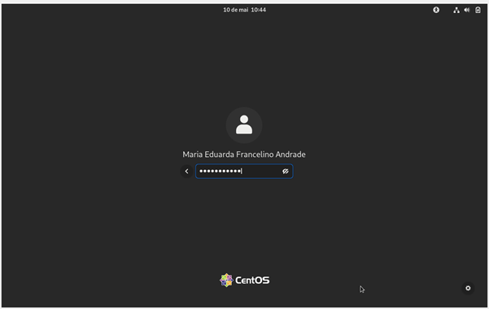

### 11º Passo
#### Desse modo sua instalação está concluída com sucesso, basta aproveitar e curtir o momento com seu novo sistema operacional.
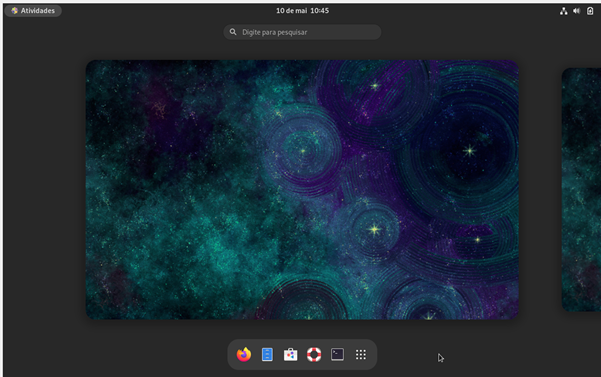